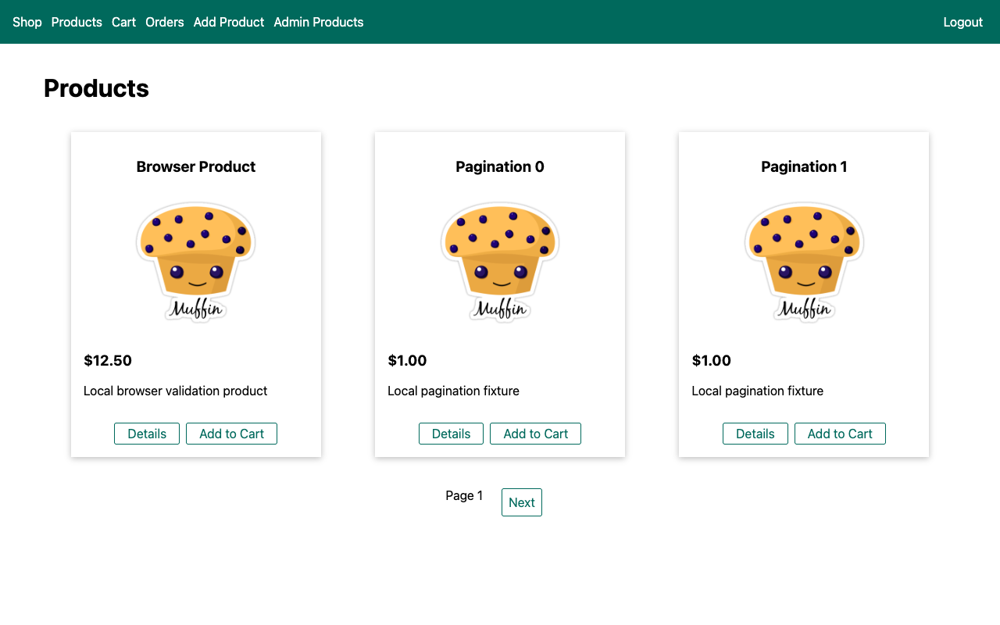
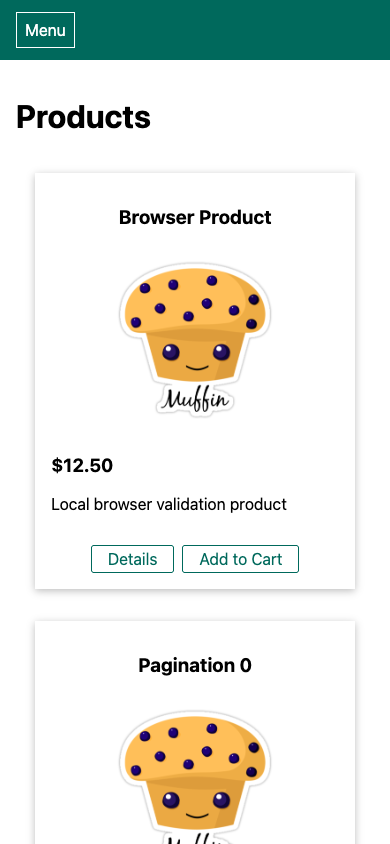

# Risa — local shop

A full-stack shopping application with an Angular frontend and an Express/MongoDB backend. Users can browse products, manage a cart, and view orders; the product administration area supports image uploads and editing.

## What you can do

- Sign up, log in, and browse a paginated product catalog.
- View product details and change cart quantities.
- Add, edit, and delete products with local image uploads.
- View existing orders and download authorized PDF invoices.

## Preview



Captured from the running application on September 30, 2026. Any sample records shown are demonstration or isolated test data, not data included with a fresh installation.

<details>
<summary>Mobile view</summary>



</details>

## Run locally

Prerequisites: the Node version in `.nvmrc` (currently 26.10.0), npm, and MongoDB Community 9.0.2. From the repository root:

```sh
npm ci
npm run setup:local
npm --prefix frontend ci
npm --prefix frontend run build
```

Start MongoDB in a foreground terminal:

```sh
mkdir -p .local/mongodb
mongod --dbpath .local/mongodb --bind_ip 127.0.0.1 --port 27018 --replSet offline-rs
```

If that local replica set already runs on port 27018, reuse it rather than starting a second instance. In another terminal at the repository root:

```sh
npm run db:init
npm start
```

Open [http://127.0.0.1:3000](http://127.0.0.1:3000). Keep both processes in the foreground and stop them with **Ctrl+C**. Setup creates a private, ignored `.env.local` without overwriting an existing file. Database initialization creates no application records. These defaults use local MongoDB; no Atlas account is required.

## Current scope

A fresh database starts empty. Legacy JSON products are preserved but are not automatically imported. Stripe checkout, email, and password-reset delivery are disabled by default and unavailable offline; the interface explains this. Optional online integrations require your own environment configuration. Express serves the built Angular frontend; legacy EJS templates remain reference/fallback files.

## Development

```sh
npm run check
npm test
npm --prefix frontend run typecheck
npm --prefix frontend test -- --browsers=ChromeHeadless
```

Backend tests use a separate local MongoDB database. For frontend development, `npm --prefix frontend start` proxies API requests to port 3000.
